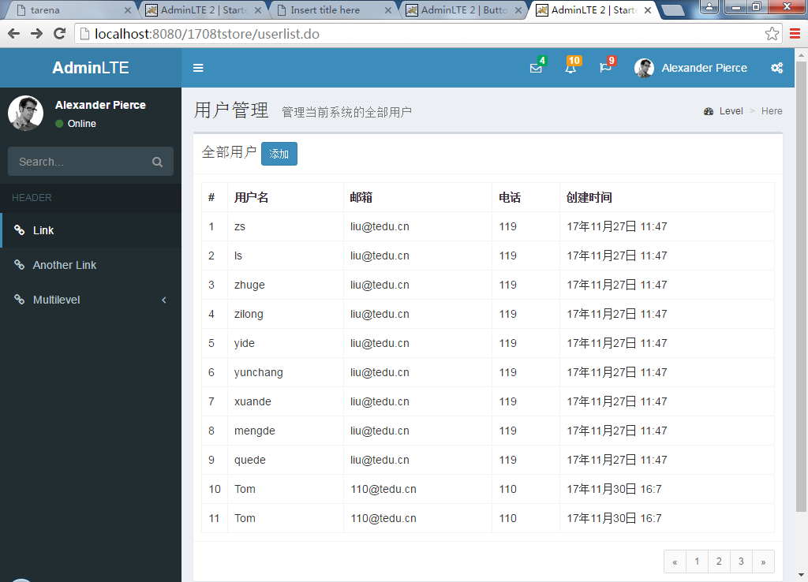
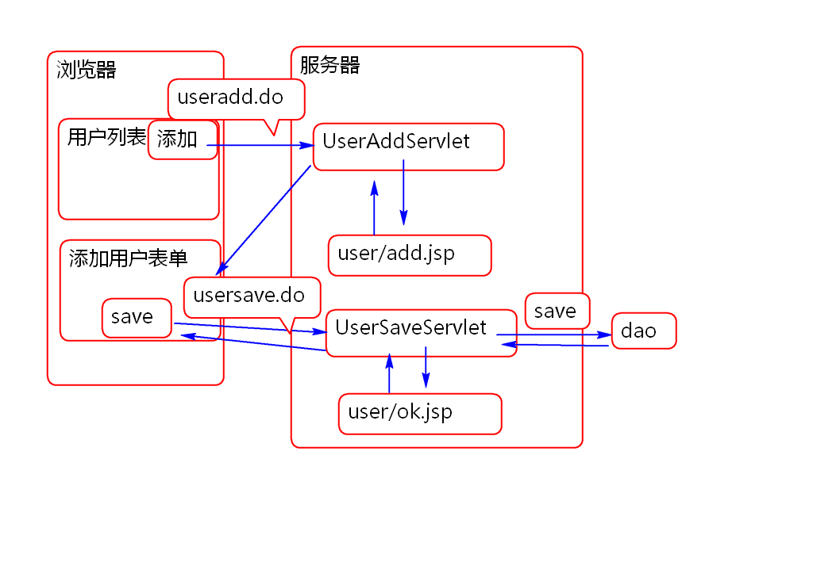
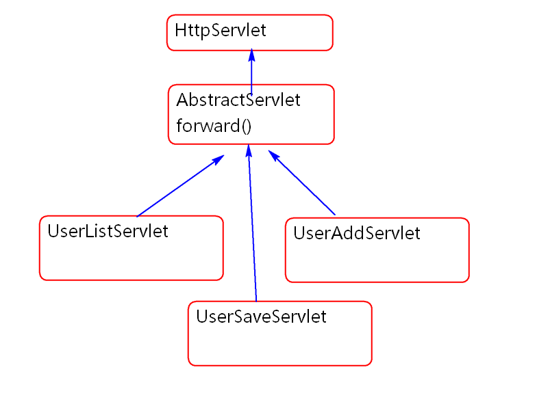
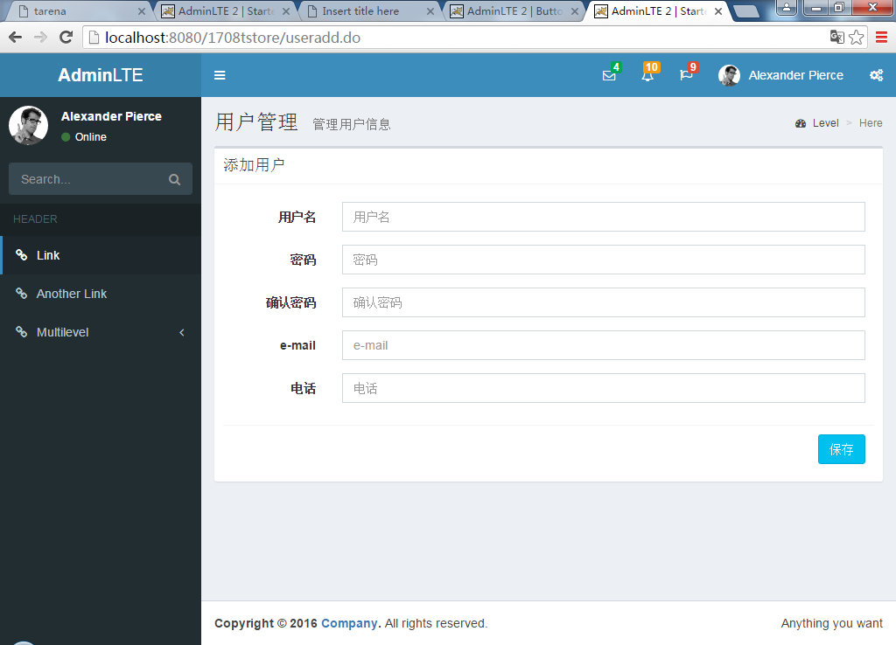

# Servlet JSP

## 什么是Web 容器

用于承载执行Web组件(Servlet/JSP)的容器软件成为Web容器.

常见Web容器(Web Server):

Tomcat, Jetty, JRun, WebSpare, WebLogic ...
这些Web容器遵守相同的标准: Servlet 标准.

Web容器也为JSP容器 Servlet容器

## 学子商城后台实现

### 用户列表功能

将数据库中的用户表中的信息显示到 浏览器 上

首先实现数据访问层方法:

1. 导入需要的包:

		<!-- WEB-INF/lib -->
		<dependency>
			<groupId>mysql-connector-java</groupId>
			<artifactId>mysql-connector-java</artifactId>
			<version>5.1.37</version>
		</dependency>

		<dependency>
			<groupId>commons-dbcp</groupId>
			<artifactId>commons-dbcp</artifactId>
			<version>1.4</version>
		</dependency>

		<dependency>
			<groupId>junit</groupId>
			<artifactId>junit</artifactId>
			<version>4.12</version>
			<scope>test</scope>
		</dependency>

2. 创建实体对象:

		public class User implements Serializable {
			
			private Integer id;
			private String username;
			private String password;
			private String email;
			private String mobile;
			private Date createTime;
			
			public User() {
			}
		
			public User(Integer id, String username, String password, String email, String mobile, Date createTime) {
				super();
				this.id = id;
				this.username = username;
				this.password = password;
				this.email = email;
				this.mobile = mobile;
				this.createTime = createTime;
			}
		
			public Integer getId() {
				return id;
			}
		
			public void setId(Integer id) {
				this.id = id;
			}
		
			public String getUsername() {
				return username;
			}
		
			public void setUsername(String username) {
				this.username = username;
			}
		
			public String getPassword() {
				return password;
			}
		
			public void setPassword(String password) {
				this.password = password;
			}
		
			public String getEmail() {
				return email;
			}
		
			public void setEmail(String email) {
				this.email = email;
			}
		
			public String getMobile() {
				return mobile;
			}
		
			public void setMobile(String mobile) {
				this.mobile = mobile;
			}
		
			public Date getCreateTime() {
				return createTime;
			}
		
			public void setCreateTime(Date createTime) {
				this.createTime = createTime;
			}
		
			@Override
			public int hashCode() {
				final int prime = 31;
				int result = 1;
				result = prime * result + ((id == null) ? 0 : id.hashCode());
				return result;
			}
		
			@Override
			public boolean equals(Object obj) {
				if (this == obj)
					return true;
				if (obj == null)
					return false;
				if (getClass() != obj.getClass())
					return false;
				User other = (User) obj;
				if (id == null) {
					if (other.id != null)
						return false;
				} else if (!id.equals(other.id))
					return false;
				return true;
			}
		
			@Override
			public String toString() {
				return "User [id=" + id + ", username=" + username + ", password=" + password + ", email=" + email + ", mobile="
						+ mobile + ", createTime=" + createTime + "]";
			}
		}

3. 创建数据库工具类, 管理数据库的连接:
	
		public class DBUtil {
			
			private static BasicDataSource dataSource;
			
			private static String driver;
			private static String url;
			private static String username;
			private static String password;
			//读取配置文件,获取4个连接参数 conf.properties
			static{
				
				try {
					//读取resource中的配置文件
					String file="conf.properties";
					InputStream in = DBUtil.class
							.getClassLoader()
							.getResourceAsStream(file);
					Properties config=new Properties();
					config.load(in);
					driver=config.getProperty("driver");
					url=config.getProperty("url");
					username=config.getProperty("username");
					password=config.getProperty("password");
					//打桩!!!
					int max=Integer.parseInt(
							config.getProperty("MaxActive"));
					//打桩!!!
					dataSource=new BasicDataSource();
					dataSource.setDriverClassName(driver);
					dataSource.setUrl(url);
					dataSource.setUsername(username);
					dataSource.setPassword(password);
					
					dataSource.setMaxActive(max); 
					
				} catch (IOException e) {
					e.printStackTrace();
					throw new RuntimeException(e);
				}
				
			}
			
			public static Connection getConnection()
				throws SQLException {
			  	Connection conn=
						dataSource.getConnection();
			  	return conn;
			}
		
			public static void commit(Connection conn){
				if(conn!=null){
					try {
						conn.commit();
					} catch (SQLException e) {
						e.printStackTrace();
					}
				}
			}
			public static void rollback(Connection conn){
				if(conn!=null){
					try {
						conn.rollback();
					} catch (SQLException e) {
						e.printStackTrace();
					}
				}
			}
			public static void close(Connection conn){
				if(conn!=null){
					try {
						conn.close();
					} catch (SQLException e) {
						e.printStackTrace();
					}
				}
			}
		} 
	
	> 利用DBCP连接池管理数据库连接.
	
	> 添加数据库连接参数配置文件 resources/conf.properties

		driver=com.mysql.jdbc.Driver
		url=jdbc:mysql://localhost:3306/tedustore
		username=root
		password=root
		MaxActive=50
		
4. 创建DAO接口

		public interface UserDao {
			
			/**
			 * 查询全部用户信息
			 * @return 包含全部用户信息的集合
			 */
			List<User> findAllUser();
		}

5. 实现Dao接口方法

		public class UserDaoImpl
			implements UserDao{
		
			public List<User> findAllUser() {
				Connection conn=null;
				try{
					conn = DBUtil.getConnection();
					String sql = "select * from user";
					Statement st=conn.createStatement();
					ResultSet rs=st.executeQuery(sql);
					List<User> list=new ArrayList<User>();
					while(rs.next()){
						User user=new User();
						user.setId(rs.getInt("id"));
						user.setUsername(
								rs.getString("username"));
						user.setPassword(
								rs.getString("password"));
						user.setEmail(
								rs.getString("email"));
						user.setMobile(
								rs.getString("mobile"));
						user.setCreateTime(
								rs.getTimestamp("create_time"));
						list.add(user);
					}
					return list;
				}catch(SQLException e){
					e.printStackTrace();
					throw new RuntimeException(e);
				}finally {
					DBUtil.close(conn);
				}
			}
		}

6. 测试:

		public class DaoTest {
			
			@Test
			public void testFindAll(){
				UserDao dao = new UserDaoImpl();
				List<User> list=dao.findAllUser();
				for (User user : list) {
					System.out.println(user); 
				}
			}
			
		}

利用Servlet和JSP配合显示用户列表:

1. 声明一个Servlet

		/**
		 * 用户列表功能 
		 */
		public class UserListServlet extends HttpServlet {
			private static final long serialVersionUID = 1L;
		
			protected void doGet(
					HttpServletRequest request, 
					HttpServletResponse response) 
				throws ServletException, IOException {
				UserDao dao = new UserDaoImpl();
				List<User> list=dao.findAllUser();
				
				//转发到 JSP 显示用户列表
				//传递数据:
				request.setAttribute("users", list);
				//转发到目标页面
				String path="/WEB-INF/jsp/user/list.jsp";
				RequestDispatcher rd=
					request.getRequestDispatcher(path);
				rd.forward(request, response); 
			}
		}	

2. 配置:

		<servlet>
			<description></description>
			<display-name>UserListServlet</display-name>
			<servlet-name>UserListServlet</servlet-name>
			<servlet-class>cn.tedu.tstore.web.UserListServlet</servlet-class>
		</servlet>
		<servlet-mapping>
			<servlet-name>UserListServlet</servlet-name>
			<url-pattern>/userlist.do</url-pattern>
		</servlet-mapping>

3. 将 template.jsp 复制为 /WEB-INF/jsp/user/list.jsp
4. 更新list.jsp, 利用JSTL和EL显示用户信息:

		<%@ page 
			contentType="text/html; charset=UTF-8"
			pageEncoding="UTF-8"
		%>
		<%@ taglib prefix="c" 
			uri="http://java.sun.com/jsp/jstl/core"%>
		<%@ taglib prefix="fmt"
			uri="http://java.sun.com/jsp/jstl/fmt" %>
		<!DOCTYPE html>
		<!--
		This is a starter template page. Use this page to start your new project from
		scratch. This page gets rid of all links and provides the needed markup only.
		-->
		<html>
		<head>
		  <meta charset="utf-8">
		  <meta http-equiv="X-UA-Compatible" content="IE=edge">
		  <title>AdminLTE 2 | Starter</title>
		  <!-- Tell the browser to be responsive to screen width -->
		  <meta content="width=device-width, initial-scale=1, maximum-scale=1, user-scalable=no" name="viewport">
		  <link rel="stylesheet" href="bower_components/bootstrap/dist/css/bootstrap.min.css">
		  <!-- Font Awesome -->
		  <link rel="stylesheet" href="bower_components/font-awesome/css/font-awesome.min.css">
		  <!-- Ionicons -->
		  <link rel="stylesheet" href="bower_components/Ionicons/css/ionicons.min.css">
		  <!-- Theme style -->
		  <link rel="stylesheet" href="dist/css/AdminLTE.min.css">
		  <!-- AdminLTE Skins. We have chosen the skin-blue for this starter
		        page. However, you can choose any other skin. Make sure you
		        apply the skin class to the body tag so the changes take effect. -->
		  <link rel="stylesheet" href="dist/css/skins/skin-blue.min.css">
		
		  <!-- HTML5 Shim and Respond.js IE8 support of HTML5 elements and media queries -->
		  <!-- WARNING: Respond.js doesn't work if you view the page via file:// -->
		  <!--[if lt IE 9]>
		  
		  
		  <![endif]-->
		
		  <!-- Google Font
		  <link rel="stylesheet"
		        href="https://fonts.googleapis.com/css?family=Source+Sans+Pro:300,400,600,700,300italic,400italic,600italic"> -->
		</head>
		<!--
		BODY TAG OPTIONS:
		=================
		Apply one or more of the following classes to get the
		desired effect
		|---------------------------------------------------------|
		| SKINS         | skin-blue                               |
		|               | skin-black                              |
		|               | skin-purple                             |
		|               | skin-yellow                             |
		|               | skin-red                                |
		|               | skin-green                              |
		|---------------------------------------------------------|
		|LAYOUT OPTIONS | fixed                                   |
		|               | layout-boxed                            |
		|               | layout-top-nav                          |
		|               | sidebar-collapse                        |
		|               | sidebar-mini                            |
		|---------------------------------------------------------|
		-->
		<body class="hold-transition skin-blue sidebar-mini">
		

		
		  <!-- 导入导航栏 -->
		  <c:import url="/WEB-INF/inc/header.jsp"/>
		
		  <!-- OK -->
		  <c:import url="/WEB-INF/inc/left-side.jsp"></c:import>
		
		  <!-- Content Wrapper. Contains page content -->
		  

		    <!-- Content Header (Page header) -->
		    <section class="content-header">
		      <h1>用户管理
		        <small>管理当前系统的全部用户</small>
		      </h1>
		      <ol class="breadcrumb">
		        <li><a href="#"><i class="fa fa-dashboard"></i> Level</a></li>
		        <li class="active">Here</li>
		      </ol>
		    </section>
		
		    <!-- Main content -->
		    <section class="content container-fluid">
		
		      <!--------------------------
		        | Your Page Content Here |
		        -------------------------->
		
		        

		          

		            

		              

		                <h3 class="box-title">全部用户</h3>
		                <a class="btn btn-sm btn-primary"
		                	href="useradd.do">添加</a>
		              

		              <!-- /.box-header -->
		              

		                <table class="table table-bordered">
		                  <tr>
		                    <th style="width: 10px">#</th>
		                    <th>用户名</th>
		                    <th>邮箱</th>
		                    <th>电话</th>
		                    <th>创建时间</th>
		                  </tr>
		                  <c:forEach items="${users}"
		                  	var="user" >
			                  <tr>
			                    <td>${user.id}</td>
			                    <td>${user.username}</td>
			                    <td>${user.email}</td>
			                    <td>${user.mobile}</td>
			                    <td><fmt:formatDate 
			                    	value="${user.createTime}"
			                    	pattern="yy年M月d日 H:m"/></td> 
			                  </tr>
		                  </c:forEach>
		                </table>
		              

		              <!-- /.box-body -->
		              

		                <ul class="pagination pagination-sm no-margin pull-right">
		                  <li><a href="#">&laquo;</a></li>
		                  <li><a href="#">1</a></li>
		                  <li><a href="#">2</a></li>
		                  <li><a href="#">3</a></li>
		                  <li><a href="#">&raquo;</a></li>
		                </ul>
		              

		            

		            <!-- /.box -->
		          

		       

		
		
		
		    </section>
		    <!-- /.content -->
		  

		  <!-- /.content-wrapper -->
		
		  <!-- Footer -->
		  <c:import url="/WEB-INF/inc/footer.jsp"></c:import>
		  
		  <c:import url="/WEB-INF/inc/sidebar.jsp"></c:import>
		 
		 
		

		<!-- ./wrapper -->
		
		<!-- REQUIRED JS SCRIPTS -->
		
		<!-- jQuery 3 -->
		
		<!-- Bootstrap 3.3.7 -->
		
		<!-- AdminLTE App -->
		
		
		<!-- Optionally, you can add Slimscroll and FastClick plugins.
		     Both of these plugins are recommended to enhance the
		     user experience. -->
		</body>
		</html>

5. 测试:

### 添加用户功能

添加用户功能的原理如下:

添加用户功能分为两大步骤:

1. 显示添加用户功能表单
2. 将用户信息保存到数据库中

由于每个Servlet都需要转发到JSP, 都需要有抽象转发得到, 所以将抽象方法定义到父类AbstractServlet中. 

 

创建AbstractServlet 包含forward方法:

	public abstract class AbstractServlet extends HttpServlet {
	
	 
		protected void forward(HttpServletRequest request, HttpServletResponse response, String path) throws ServletException, IOException {
			RequestDispatcher rd=
				request.getRequestDispatcher(path);
			rd.forward(request, response);
		}
	
	}

重构 UserListServlet

	/**
	 * 用户列表功能 
	 */
	public class UserListServlet extends AbstractServlet {
		private static final long serialVersionUID = 1L;
	
		protected void doGet(
				HttpServletRequest request, 
				HttpServletResponse response) 
			throws ServletException, IOException {
			UserDao dao = new UserDaoImpl();
			List<User> list=dao.findAllUser();
			
			//转发到 JSP 显示用户列表
			//传递数据:
			request.setAttribute("users", list);
			//转发到目标页面
			String path="/WEB-INF/jsp/user/list.jsp";
			RequestDispatcher rd=
				request.getRequestDispatcher(path);
			rd.forward(request, response); 
		}
	
	}

实现添加用户功能的第一步, 显示添加表单: 

0. 在 list.jsp 页面上添加按钮, 链接到 useradd.do

		...
	      

	        <h3 class="box-title">全部用户</h3>
	        <a class="btn btn-sm btn-primary"
	        	href="useradd.do">添加</a>
	      

		...

	> 按钮元素的 class 请参看 AdminLTE 提供的参看模板.

1. 创建Servlet

		/**
		 * 显示添加用户的界面 
		 */
		public class UserAddServlet extends AbstractServlet {
			private static final long serialVersionUID = 1L;
		    
			protected void doGet(
					HttpServletRequest request, 
					HttpServletResponse response) 
				throws ServletException, IOException {
				
				String path="/WEB-INF/jsp/user/add.jsp";
				forward(request, response, path); 
			}
		}

	> 这里要从AbstractServlet类继承, 这样就可以使用forward方法了.

2. 配置 web.xml

		<servlet>
			<description></description>
			<display-name>UserAddServlet</display-name>
			<servlet-name>UserAddServlet</servlet-name>
			<servlet-class>cn.tedu.tstore.web.UserAddServlet</servlet-class>
		</servlet>
		<servlet-mapping>
			<servlet-name>UserAddServlet</servlet-name>
			<url-pattern>/useradd.do</url-pattern>
		</servlet-mapping>

3. 编写 add.jsp
	
	> 将template.jsp 复制到/WEB-INF/jsp/user/add.jsp
	
	> 将form.html 中的表单部分内容复制到 add.jsp 的内容区域

	> 为form添加属性 method 和 action, 为每个input元素添加name属性

		<%@ page 
			contentType="text/html; charset=UTF-8"
			pageEncoding="UTF-8"
		%>
		<%@ taglib prefix="c" 
			uri="http://java.sun.com/jsp/jstl/core"%>
		<!DOCTYPE html>
		<!--
		This is a starter template page. Use this page to start your new project from
		scratch. This page gets rid of all links and provides the needed markup only.
		-->
		<html>
		<head>
		  <meta charset="utf-8">
		  <meta http-equiv="X-UA-Compatible" content="IE=edge">
		  <title>AdminLTE 2 | Starter</title>
		  <!-- Tell the browser to be responsive to screen width -->
		  <meta content="width=device-width, initial-scale=1, maximum-scale=1, user-scalable=no" name="viewport">
		  <link rel="stylesheet" href="bower_components/bootstrap/dist/css/bootstrap.min.css">
		  <!-- Font Awesome -->
		  <link rel="stylesheet" href="bower_components/font-awesome/css/font-awesome.min.css">
		  <!-- Ionicons -->
		  <link rel="stylesheet" href="bower_components/Ionicons/css/ionicons.min.css">
		  <!-- Theme style -->
		  <link rel="stylesheet" href="dist/css/AdminLTE.min.css">
		  <!-- AdminLTE Skins. We have chosen the skin-blue for this starter
		        page. However, you can choose any other skin. Make sure you
		        apply the skin class to the body tag so the changes take effect. -->
		  <link rel="stylesheet" href="dist/css/skins/skin-blue.min.css">
		
		  <!-- HTML5 Shim and Respond.js IE8 support of HTML5 elements and media queries -->
		  <!-- WARNING: Respond.js doesn't work if you view the page via file:// -->
		  <!--[if lt IE 9]>
		  
		  
		  <![endif]-->
		
		  <!-- Google Font
		  <link rel="stylesheet"
		        href="https://fonts.googleapis.com/css?family=Source+Sans+Pro:300,400,600,700,300italic,400italic,600italic"> -->
		</head>
		<!--
		BODY TAG OPTIONS:
		=================
		Apply one or more of the following classes to get the
		desired effect
		|---------------------------------------------------------|
		| SKINS         | skin-blue                               |
		|               | skin-black                              |
		|               | skin-purple                             |
		|               | skin-yellow                             |
		|               | skin-red                                |
		|               | skin-green                              |
		|---------------------------------------------------------|
		|LAYOUT OPTIONS | fixed                                   |
		|               | layout-boxed                            |
		|               | layout-top-nav                          |
		|               | sidebar-collapse                        |
		|               | sidebar-mini                            |
		|---------------------------------------------------------|
		-->
		<body class="hold-transition skin-blue sidebar-mini">
		

		
		  <!-- 导入导航栏 -->
		  <c:import url="/WEB-INF/inc/header.jsp"/>
		
		  <!-- OK -->
		  <c:import url="/WEB-INF/inc/left-side.jsp"></c:import>
		
		  <!-- Content Wrapper. Contains page content -->
		  

		    <!-- Content Header (Page header) -->
		    <section class="content-header">
		      <h1>用户管理
		        <small>管理用户信息</small>
		      </h1>
		      <ol class="breadcrumb">
		        <li><a href="#"><i class="fa fa-dashboard"></i> Level</a></li>
		        <li class="active">Here</li>
		      </ol>
		    </section>
		
		    <!-- Main content -->
		    <section class="content container-fluid">
		
		      <!--------------------------
		        | Your Page Content Here |
		        -------------------------->
		
		        

		          

		            

		              

		                <h3 class="box-title">添加用户</h3>
		              

		              <!-- /.box-header -->
		              

		                
		                <!-- 表单 -->
		
		                <!-- form start -->
		                <form class="form-horizontal" 
		                  method="post" action="usersave.do">  
		                  

		                    

		                      <label for="inputEmail3" class="col-sm-2 control-label">用户名</label>
		        
		                      

		                        <input type="text" class="form-control" 
		                          id="inputEmail3" placeholder="用户名"
		                          name="username">
		                      

		                    

		                    

		                      <label for="inputPassword3" class="col-sm-2 control-label">密码</label>
		        
		                      

		                        <input type="password" class="form-control"
		                         id="inputPassword3" placeholder="密码"
		                         name="password">
		                      

		                    

		                    

		                      <label for="inputConfirm" class="col-sm-2 control-label">确认密码</label>
		        
		                      

		                        <input type="password" class="form-control" 
		                         id="inputConfirm" placeholder="确认密码"
		                         name="confirm">
		                      

		                    

		
		                    

		                      <label for="inputEmail" class="col-sm-2 control-label">e-mail</label>
		        
		                      

		                        <input type="email" class="form-control" 
		                        id="inputEmail" placeholder="e-mail"
		                        name="email">
		                      

		                    

		
		                    

		                      <label for="inputMobile" class="col-sm-2 control-label">电话</label>
		        
		                      

		                        <input type="text" class="form-control"
		                         id="inputMobile" placeholder="电话"
		                         name="mobile">
		                      

		                    

		                  

		                  <!-- /.box-body -->
		                  

		                    <button type="submit" class="btn btn-info pull-right">保存</button>
		                  

		                  <!-- /.box-footer -->
		                </form>
		
		       
		              

		              <!-- /.box-body -->
		
		            

		            <!-- /.box -->
		          

		       

		
		
		
		    </section>
		    <!-- /.content -->
		  

		  <!-- /.content-wrapper -->
		
		  <!-- Footer -->
		  <c:import url="/WEB-INF/inc/footer.jsp"></c:import>
		  
		  <c:import url="/WEB-INF/inc/sidebar.jsp"></c:import>
		 
		 
		

		<!-- ./wrapper -->
		
		<!-- REQUIRED JS SCRIPTS -->
		
		<!-- jQuery 3 -->
		
		<!-- Bootstrap 3.3.7 -->
		
		<!-- AdminLTE App -->
		
		
		<!-- Optionally, you can add Slimscroll and FastClick plugins.
		     Both of these plugins are recommended to enhance the
		     user experience. -->
		</body>
		</html>

4. 测试

		

实现添加用户功能的第二步, 保存数据到数据库

1. 在UserDao中添加dao接口方法

		/**
		 * 将用户信息保存到数据库中
		 * user的ID是自动生成的.
		 * @param user 是用户信息
		 */
		void saveUser(User user);

2. 在UserDaoImpl中实现dao接口方法

		public void saveUser(User user) {
			Connection conn = null;
			try {
				conn = DBUtil.getConnection();
				String sql = "insert into user "
						+ "(id, username, "
						+ "password, email, "
						+ "mobile, create_time ) "
						+ "values (null,?,?,?,?,?)";
				PreparedStatement ps=
						conn.prepareStatement(sql,
						new String[]{"id"});
				ps.setString(1, user.getUsername());
				ps.setString(2, user.getPassword());
				ps.setString(3, user.getEmail());
				ps.setString(4, user.getMobile());
				long l=user.getCreateTime().getTime();
				ps.setTimestamp(5,new Timestamp(l)); 
				//执行SQL
				int n = ps.executeUpdate();
				if(n!=1){
					throw new RuntimeException("保存失败");
				}
				//读取自动生成的ID
				//Generated 生成的 key:关键字id
				ResultSet rs=ps.getGeneratedKeys();
				while(rs.next()){
					user.setId(rs.getInt(1));  
				}
				
			} catch (Exception e) {
				e.printStackTrace();
				throw new RuntimeException(e);
			}finally {
				DBUtil.close(conn); 
			}
		}

3. 测试:

		@Test
		public void testSaveUser(){
			User user=new User(null,
					"Tom", "123", "110@tedu.cn",
					"110", new Date());
			System.out.println(user); 
			UserDao dao = new UserDaoImpl();
			dao.saveUser(user); 
			System.out.println(user); 
		}

5. 编写Servlet

		/**
		 * 保存用户信息到 数据库  
		 */
		public class UserSaveServlet 
			extends AbstractServlet {
			private static final long serialVersionUID = 1L;
			
			protected void doPost(
					HttpServletRequest request, 
					HttpServletResponse response) 
				throws ServletException, IOException {
				//获取用户提交非表单信息
				request.setCharacterEncoding("UTF-8");
				String username=
						request.getParameter("username");
				String password=
						request.getParameter("password");
				String confirm=
						request.getParameter("confirm");
				String email=
						request.getParameter("email");
				String mobile=
						request.getParameter("mobile");
				//检验表单信息
				//调用dao保存信息
				UserDao dao = new UserDaoImpl();
				User user= new User(null, username,
						password, email, mobile,
						new Date());
				dao.saveUser(user);
				//转发到成功页面
				//request.setAttribute("user", user);
				request.setAttribute("message", 
						"成功添加:"+user);
				String path="/WEB-INF/jsp/ok.jsp";
				forward(request, response, path);  
			}
		}

5. 配置 web.xml

		<servlet>
			<description></description>
			<display-name>UserSaveServlet</display-name>
			<servlet-name>UserSaveServlet</servlet-name>
			<servlet-class>cn.tedu.tstore.web.UserSaveServlet</servlet-class>
		</servlet>
		<servlet-mapping>
			<servlet-name>UserSaveServlet</servlet-name>
			<url-pattern>/usersave.do</url-pattern>
		</servlet-mapping>

6. 添加 /WEB-INF/jsp/ok.jsp, 模板来自 template.jsp

		<%@ page 
			contentType="text/html; charset=UTF-8"
			pageEncoding="UTF-8"
		%>
		<%@ taglib prefix="c" 
			uri="http://java.sun.com/jsp/jstl/core"%>
		<!DOCTYPE html>
		<!--
		This is a starter template page. Use this page to start your new project from
		scratch. This page gets rid of all links and provides the needed markup only.
		-->
		<html>
		<head>
		  <meta charset="utf-8">
		  <meta http-equiv="X-UA-Compatible" content="IE=edge">
		  <title>AdminLTE 2 | Starter</title>
		  <!-- Tell the browser to be responsive to screen width -->
		  <meta content="width=device-width, initial-scale=1, maximum-scale=1, user-scalable=no" name="viewport">
		  <link rel="stylesheet" href="bower_components/bootstrap/dist/css/bootstrap.min.css">
		  <!-- Font Awesome -->
		  <link rel="stylesheet" href="bower_components/font-awesome/css/font-awesome.min.css">
		  <!-- Ionicons -->
		  <link rel="stylesheet" href="bower_components/Ionicons/css/ionicons.min.css">
		  <!-- Theme style -->
		  <link rel="stylesheet" href="dist/css/AdminLTE.min.css">
		  <!-- AdminLTE Skins. We have chosen the skin-blue for this starter
		        page. However, you can choose any other skin. Make sure you
		        apply the skin class to the body tag so the changes take effect. -->
		  <link rel="stylesheet" href="dist/css/skins/skin-blue.min.css">
		
		  <!-- HTML5 Shim and Respond.js IE8 support of HTML5 elements and media queries -->
		  <!-- WARNING: Respond.js doesn't work if you view the page via file:// -->
		  <!--[if lt IE 9]>
		  
		  
		  <![endif]-->
		
		  <!-- Google Font
		  <link rel="stylesheet"
		        href="https://fonts.googleapis.com/css?family=Source+Sans+Pro:300,400,600,700,300italic,400italic,600italic"> -->
		</head>
		<!--
		BODY TAG OPTIONS:
		=================
		Apply one or more of the following classes to get the
		desired effect
		|---------------------------------------------------------|
		| SKINS         | skin-blue                               |
		|               | skin-black                              |
		|               | skin-purple                             |
		|               | skin-yellow                             |
		|               | skin-red                                |
		|               | skin-green                              |
		|---------------------------------------------------------|
		|LAYOUT OPTIONS | fixed                                   |
		|               | layout-boxed                            |
		|               | layout-top-nav                          |
		|               | sidebar-collapse                        |
		|               | sidebar-mini                            |
		|---------------------------------------------------------|
		-->
		<body class="hold-transition skin-blue sidebar-mini">
		

		
		  <!-- 导入导航栏 -->
		  <c:import url="/WEB-INF/inc/header.jsp"/>
		
		  <!-- OK -->
		  <c:import url="/WEB-INF/inc/left-side.jsp"></c:import>
		
		  <!-- Content Wrapper. Contains page content -->
		  

		    <!-- Content Header (Page header) -->
		    <section class="content-header">
		      <h1>大标题
		        Page Header
		        <small>Optional description</small>
		      </h1>
		      <ol class="breadcrumb">
		        <li><a href="#"><i class="fa fa-dashboard"></i> Level</a></li>
		        <li class="active">Here</li>
		      </ol>
		    </section>
		
		    <!-- Main content -->
		    <section class="content container-fluid">
		
		      <!--------------------------
		        | Your Page Content Here |
		        -------------------------->
		
		        

		          

		            

		              

		                <h3 class="box-title">Bordered Table</h3>
		              

		              <!-- /.box-header -->
		              

		                
		                
${message}

		              
		              

		            

		            <!-- /.box -->
		          

		       

		
		
		
		    </section>
		    <!-- /.content -->
		  

		  <!-- /.content-wrapper -->
		
		  <!-- Footer -->
		  <c:import url="/WEB-INF/inc/footer.jsp"></c:import>
		  
		  <c:import url="/WEB-INF/inc/sidebar.jsp"></c:import>
		 
		 
		

		<!-- ./wrapper -->
		
		<!-- REQUIRED JS SCRIPTS -->
		
		<!-- jQuery 3 -->
		
		<!-- Bootstrap 3.3.7 -->
		
		<!-- AdminLTE App -->
		
		
		<!-- Optionally, you can add Slimscroll and FastClick plugins.
		     Both of these plugins are recommended to enhance the
		     user experience. -->
		</body>
		</html>

7. 测试

添加表单检验功能:

1. 重构 UserSaveServlet

		//检验表单信息
		String input="/WEB-INF/jsp/user/add.jsp";
		if(username==null || 
				username.trim().isEmpty()){
			request.setAttribute(
				"error","用户名不能空");
			forward(request, response, input);
			return;//不结束, 将出现异常!
		}
		String reg = "\\w{6,10}";
		if(! username.matches(reg)){
			request.setAttribute(
					"error","用户名6~10字符");
			forward(request, response, input);
			return;//不结束, 将出现异常!
		}

2. 重构 add.jsp

        <h3 class="box-title">添加用户
          <small>${error}</small>
        </h3>

3. 测试

============================

## 作业

1. 实现用户列表功能
2. 实现添加用户功能

